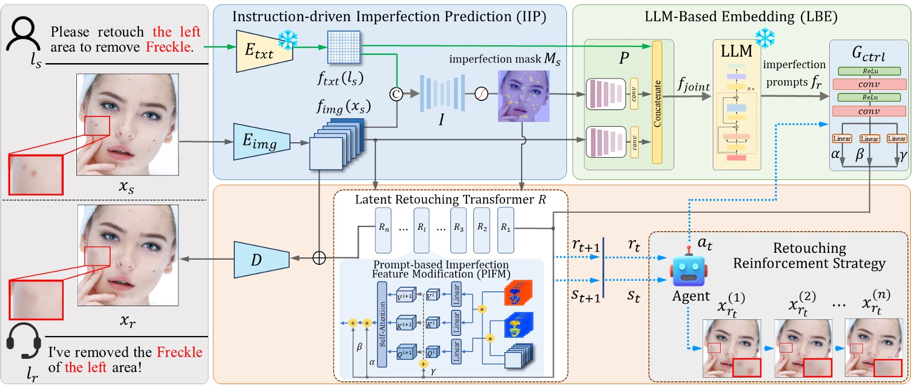

# RetouchGPT: LLM-based Interactive High-Fidelity Face Retouching via Imperfection Prompting



[Wen Xue](https://scholar.google.com.hk/citations?user=OXAPkaEAAAAJ&hl=zh-CN&oi=sra), Chun Ding, [RuoTao Xu](https://scholar.google.com.hk/citations?hl=zh-CN&user=9lfce18AAAAJ), [Yong Xu](https://scholar.google.com/citations?user=1hx5iwEAAAAJ), [Si Wu](https://scholar.google.com.hk/citations?user=RtkXrnwAAAAJ&hl=zh-CN&oi=sra)*, [Hau-San Wong](https://scholar.google.com.hk/citations?user=i9Dh1OkAAAAJ&hl=zh-CN)<br/>

[South China University of Technology](https://www.scut.edu.cn/en/), Institute of Super Robotics, [City University of Hong Kong](https://www.cityu.edu.hk/)

This is the official code of **AAAI 2025**: *RetouchGPT: LLM-based Interactive High-Fidelity Face Retouching via Imperfection Prompting*.

<blockquote> <strong>Abstract:</strong> <em>Face retouching aims to remove facial imperfections from images and videos while preserving face attributes. Existing methods are designed for non-interactive, end-to-end retouching, yet interactivity is highly demanded in downstream applications. In this paper, we propose RetouchGPT, a novel framework that leverages Large Language Models (LLMs) to guide the interactive retouching process. Towards this end, we design an instruction-driven imperfection prediction module to accurately identify imperfections by integrating textual and visual features. To learn imperfection prompts, we further incorporate an LLM-based embedding module to fuse multi-modal conditioning information. The prompt-based feature modification is performed in each transformer block, progressively suppressing imperfection features and replacing them with normal skin features. Extensive experiments validate the effectiveness of our design and demonstrate that RetouchGPT is a useful tool for interactive face retouching, achieving superior performance over state-of-the-art methods.</em> </blockquote>

------

## Main contributions:

**RetouchGPT** achieves user feedback-aligned and high-fidelity retouching results under the guidance of large language models (LLMs). The key contributions of this work include:   

- **Interactive Retouching:** Different from the existing methods that perform single-stage face retouching, the proposed RetouchGPT is capable of interactive retouching by working together with LLM.  
- **Instruction-Driven Imperfection Prediction (IIP):** By integrating user’s instruction and visual features, facial imperfection prediction performance can be improved significantly.
- **LLM-Based Embedding (LBE):** Designed the LBE module to fuse textual and visual conditioning information, generating imperfection prompts. These prompts guide content generation in imperfection regions by leveraging a latent transformer with cross-attention-based feature modification at each block.   
- **State-of-the-Art Performance:** We fuse multimodal conditioning information via LLM to obtain imperfection prompts, which controls imperfection feature modification in the interactive retouching process.  

------

## Setup Instructions

To run RetouchGPT, follow these steps:

### 1. Install Requirements

- Install and activate the required packages using the requirements.txt file:

  ```
  conda create -n retouchgpt python=3.8
  pip install -r requirements.txt
  ```

### 2. Download Dataset

- Obtain the **Flickr-Faces-HQ-Retouching (FFHQR) Dataset**.

- Arrange the dataset in the following structure:

  ```
  face_retouching/
  ├── train/
  │   ├── source/
  │   └── target/
  └── test/
      ├── source/
      └── target/
  ```

### 3. Download LLM

- Select and download your preferred **Large Language Model (LLM)**. Ensure it is compatible with your hardware.

### 4. Train the Model

- Navigate to the project directory and activate the environment:

  ```bash
  cd RetouchGPT
  conda activate retouchgpt
  python train.py
  ```

```
------

## Testing Instructions

To test RetouchGPT:

1. **Navigate to the Project Directory**:

   ```bash
   cd RetouchGPT
```

2. **Run the Testing Script**:
   Execute the testing script with:

   ```bash
   python test.py
   ```

- You can input user instructions and in-the-wild images for retouching purposes.

